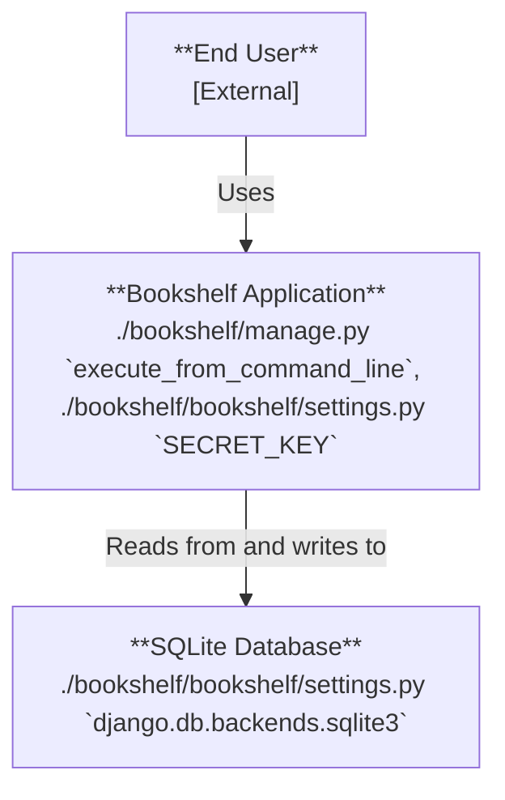
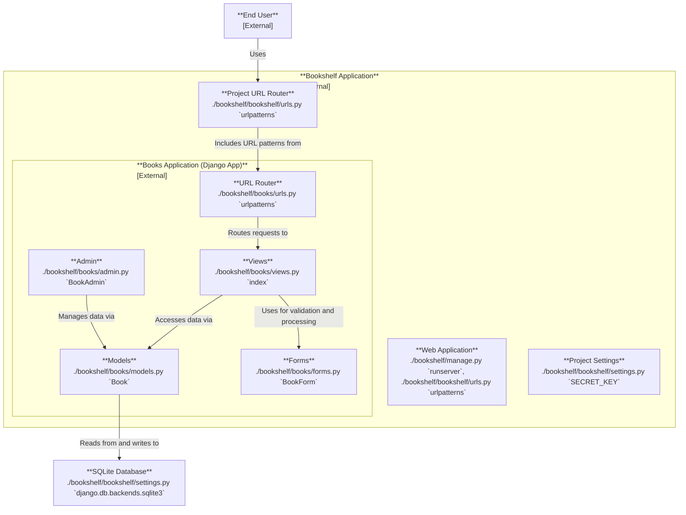

# Diagram 1

```mermaid
graph TD

    base.cv::bookshelf_system["**Bookshelf Application**<br>./bookshelf/manage.py `execute_from_command_line`, ./bookshelf/bookshelf/settings.py `SECRET_KEY`"]
    base.cv::sqlite_db["**SQLite Database**<br>./bookshelf/bookshelf/settings.py `django.db.backends.sqlite3`"]
    base.cv::end_user["**End User**<br>[External]"]
    %% Edges at this level (grouped by source)
    base.cv::end_user["**End User**<br>[External]"] -->|"Uses"| base.cv::bookshelf_system["**Bookshelf Application**<br>./bookshelf/manage.py `execute_from_command_line`, ./bookshelf/bookshelf/settings.py `SECRET_KEY`"]
    base.cv::bookshelf_system["**Bookshelf Application**<br>./bookshelf/manage.py `execute_from_command_line`, ./bookshelf/bookshelf/settings.py `SECRET_KEY`"] -->|"Reads from and writes to"| base.cv::sqlite_db["**SQLite Database**<br>./bookshelf/bookshelf/settings.py `django.db.backends.sqlite3`"]

```
# Diagram 2

```mermaid
graph TD

    bookshelf_container.cv::end_user["**End User**<br>[External]"]
    bookshelf_container.cv::sqlite_db["**SQLite Database**<br>./bookshelf/bookshelf/settings.py `django.db.backends.sqlite3`"]
    subgraph bookshelf_container.cv::bookshelf_system["**Bookshelf Application**<br>[External]"]
        bookshelf_container.cv::webapp["**Web Application**<br>./bookshelf/manage.py `runserver`, ./bookshelf/bookshelf/urls.py `urlpatterns`"]
        bookshelf_container.cv::project_urls["**Project URL Router**<br>./bookshelf/bookshelf/urls.py `urlpatterns`"]
        bookshelf_container.cv::project_settings["**Project Settings**<br>./bookshelf/bookshelf/settings.py `SECRET_KEY`"]
        subgraph bookshelf_container.cv::books_app["**Books Application (Django App)**<br>[External]"]
            bookshelf_container.cv::books_views["**Views**<br>./bookshelf/books/views.py `index`"]
            bookshelf_container.cv::books_models["**Models**<br>./bookshelf/books/models.py `Book`"]
            bookshelf_container.cv::books_forms["**Forms**<br>./bookshelf/books/forms.py `BookForm`"]
            bookshelf_container.cv::books_admin["**Admin**<br>./bookshelf/books/admin.py `BookAdmin`"]
            bookshelf_container.cv::books_urls["**URL Router**<br>./bookshelf/books/urls.py `urlpatterns`"]
            %% Edges at this level (grouped by source)
            bookshelf_container.cv::books_urls["**URL Router**<br>./bookshelf/books/urls.py `urlpatterns`"] -->|"Routes requests to"| bookshelf_container.cv::books_views["**Views**<br>./bookshelf/books/views.py `index`"]
            bookshelf_container.cv::books_views["**Views**<br>./bookshelf/books/views.py `index`"] -->|"Accesses data via"| bookshelf_container.cv::books_models["**Models**<br>./bookshelf/books/models.py `Book`"]
            bookshelf_container.cv::books_views["**Views**<br>./bookshelf/books/views.py `index`"] -->|"Uses for validation and processing"| bookshelf_container.cv::books_forms["**Forms**<br>./bookshelf/books/forms.py `BookForm`"]
            bookshelf_container.cv::books_admin["**Admin**<br>./bookshelf/books/admin.py `BookAdmin`"] -->|"Manages data via"| bookshelf_container.cv::books_models["**Models**<br>./bookshelf/books/models.py `Book`"]
        end
        %% Edges at this level (grouped by source)
        bookshelf_container.cv::project_urls["**Project URL Router**<br>./bookshelf/bookshelf/urls.py `urlpatterns`"] -->|"Includes URL patterns from"| bookshelf_container.cv::books_urls["**URL Router**<br>./bookshelf/books/urls.py `urlpatterns`"]
    end
    %% Edges at this level (grouped by source)
    bookshelf_container.cv::end_user["**End User**<br>[External]"] -->|"Uses"| bookshelf_container.cv::project_urls["**Project URL Router**<br>./bookshelf/bookshelf/urls.py `urlpatterns`"]
    bookshelf_container.cv::books_models["**Models**<br>./bookshelf/books/models.py `Book`"] -->|"Reads from and writes to"| bookshelf_container.cv::sqlite_db["**SQLite Database**<br>./bookshelf/bookshelf/settings.py `django.db.backends.sqlite3`"]

```
---
*Generated by [CodeViz.ai](https://codeviz.ai) on 19.09.2026, 16:10:02*
